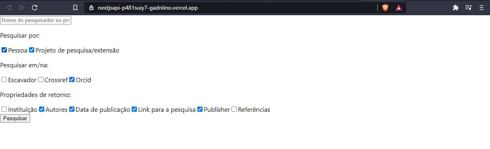
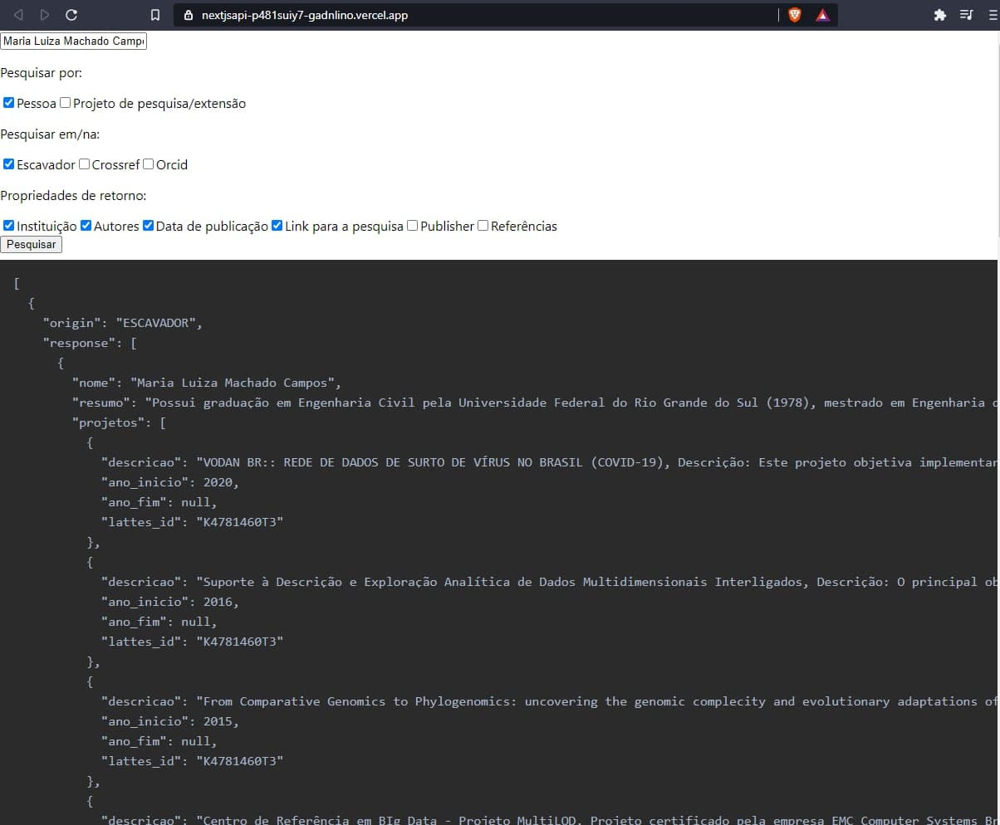

# API de Escavação 

Projeto Final da Matéria Computação e Sociedade.

O Objetivo do projeto é fornecer uma API com endpoint único, que permite acesso à dados sobre projetos de pesquisa, Projetos de Extensão, etc, de pesquisadores e alunos da UFRJ, acessando diversas APIs e realizando uma junção dos resultados.

# APIs Utilizadas

- Escavador
- CrossRef
- Orcid
- ~~Google Schoolar~~
- ~~Microsoft Academic Knowledge~~
- ~~Web Of Science~~

# Funcionamento Geral

O Usuário pode realizar uma busca através do nome do pesquisador, então o sistema vai fazer uma busca em cada uma das APIs, filtrar resultados pertencentes à pessoas relacionadas à UFRJ, e então fazer uma junção dos resultados para exibir os Dados.


# Dados Disponíveis

Para cada pessoa pesquisada, a aplicação pode retornar os seguintes dados:

- Formação academica/profissional
- Artigos publicados
- Resumo disponível no currículo Lattes
- Lista dos **projetos de pesquisa** contendo:
  - Data de Início do Projeto 
  - Data de Fim do Projeto
  - Descrição
- Lista dos **projetos de extensão** contendo:
  - Data de início do projeto 
  - Data de fim do projeto
  - Descrição

# Algumas Especificações de cada API:
### Escavador
  - O Escavador tem sua busca feita primordialmente pelo nome da pessoa e tem a capacidade de retornar dados baseados no currículo lattes do pesquisado, i.e., resumo curricular, projetos de pesquisa, formação acadêmica/profissional e outros.
### CrossRef
  - O Crossref faz busca por artigos publicados, a pesquisa é feita pelo nome da pessoa ou pelo nome do artigo em si. Ele traz a possibilidade de encontrar contribuintes dos artigos, juntamente com um link para tal.
### Orcid
  - O Orcid é uma plataforma parecida com Lattes e que trabalha de forma global. A API permite que consigamos encontrar todos os projetos de uma pessoa a partir de um ORCID ID que podemos encontrar a partir do nome da pessoa. 
### Google Scholar
  - A API Google Scholar permite a busca por todo a base do google de artigos. Podemos pesquisar tanto pelo projeto quanto pelo nome da pessoa e ele retornará uma lista de resultados equivalente a uma pesquisa direta no google scholar, mas com possibilidade de adicionar parâmetros de filtro.
### Microsoft Academic Knowledge
  - Essa API traz uma abordagem um pouco diferente das demais. Além da possibilidade de trazer os artigos e projetos, ela tem como foco principal gerar dados a respeito do projeto. Ex: número de vezes em que artigo aparece para um resultado de pesquisa no bing.
### Web Of Science
  - Essa API também traz informações relevantes a respeito de artigos, publicações e dos autores e participantes do projeto. A busca pode ser feita pelo nome das pessoas ou projetos, também.


# API

## Endereço(apiAddress)

https://nextjsapi-eight.vercel.app/

## Rotas
### **GET**    ```/API/search/```
Retorna os dados da pessoa à partir do nome. Os dados retornados dependem dos parâmetros passados.

### Parâmetros:
SearchValue (```String```): 
- Descrição: Nome Da Pessoa/Projeto Buscado.

apis (```String[]```): 
- Define as APIS que serão utilizadas para a pesquisa.
- Exemplo: ```[ 'CROSSREF', 'ESCAVADOR', 'ORCID' ]```
- Valores: 'CROSSREF', 'ESCAVADOR', 'ORCID'

SearchTypes (```String[]```):
- Tipo de Entidade Retornada pela request 
- Exemplo: ```[ 'PESSOA', 'PROJETO_PESQUISA_EXTENSAO' ]```
- Valores Possíveis:  'PESSOA', 'PROJETO_PESQUISA_EXTENSAO' 

returnProps (```String[]```):
- Descrição: Dados Que serão retornados pela request
- Exemplo: ```[ 'AUTORES', 'INSTITUICAO', 'DATA_PUBLICACAO' ]```
- Valores Possíveis: 'AUTORES', 'INSTITUICAO', 'DATA_PUBLICACAO', 'LINK_PESQUISA', 'PUBLISHER', 'REFERENCIAS'

## Exemplos

### Exemplos de Request via interface:

- Seleção de parâmetros para request:



- Seleção de parâmetros com retorno:



### Exemplo De Request com curl:

```bash
curl -X GET 'http://{apiAddress}/api/search?apis=CROSSREF&apis=ESCAVADOR&searchValue=Maria Luiza Machado Campos&searchTypes=PESSOA&returnProps=AUTORES&returnProps=REFERENCIAS'
```

### Exemplo De Request utilizando Axios:

```javascript
  import axios from 'axios';

  const parameters = {
    SearchValue: 'Jayme Luiz Szwarcfiter',
    apis: ['CROSSREF', 'ESCAVADOR', 'ORCID' ],
    searchTypes: [ 'PESSOA', 'PROJETO_PESQUISA_EXTENSAO' ],
    returnProps: [
      'AUTORES', 
      'INSTITUICAO', 
      'DATA_PUBLICACAO', 
      'LINK_PESQUISA', 
      'PUBLISHER', 
      'REFERENCIAS'
      ]
  }

  const response = await axios.get(
            'http://{apiAddress}/api/search',
            { params:  parameters});
```
#### Integrantes do grupo

- [Eduardo Leão](https://github.com/LeaoEduardo/)
- [Guilherme Avelino](https://github.com/gadnlino/)
- [Renan Ignacio](https://github.com/RenanIOliveira)
